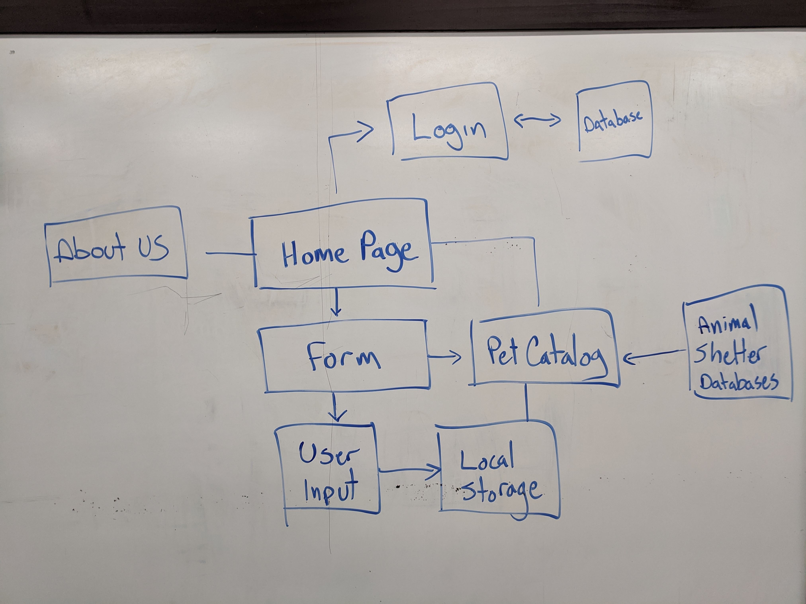
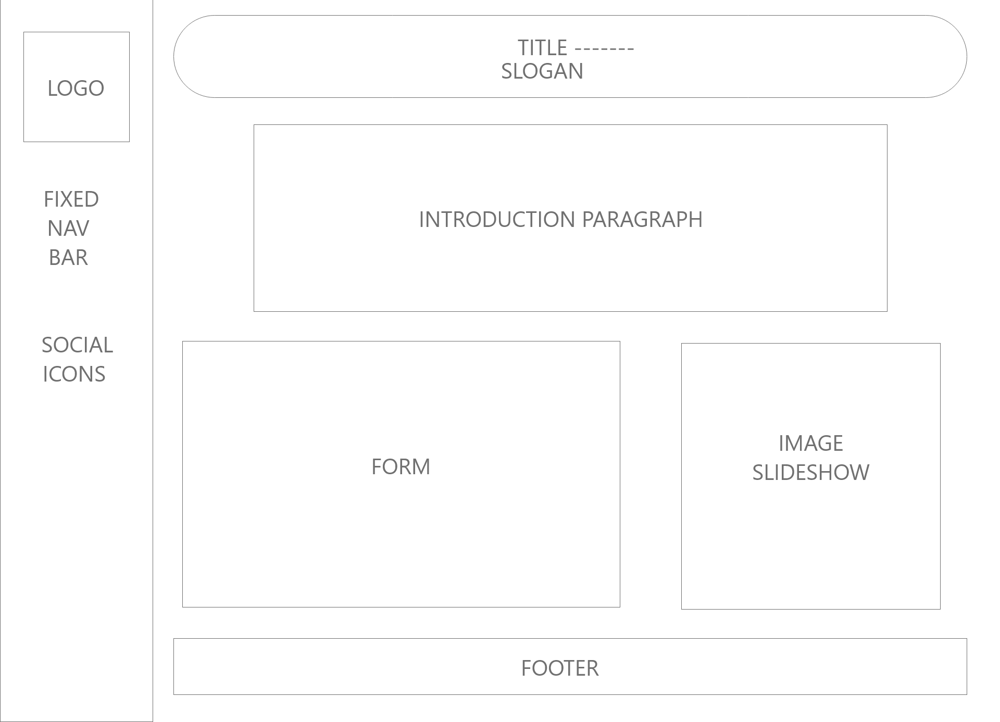
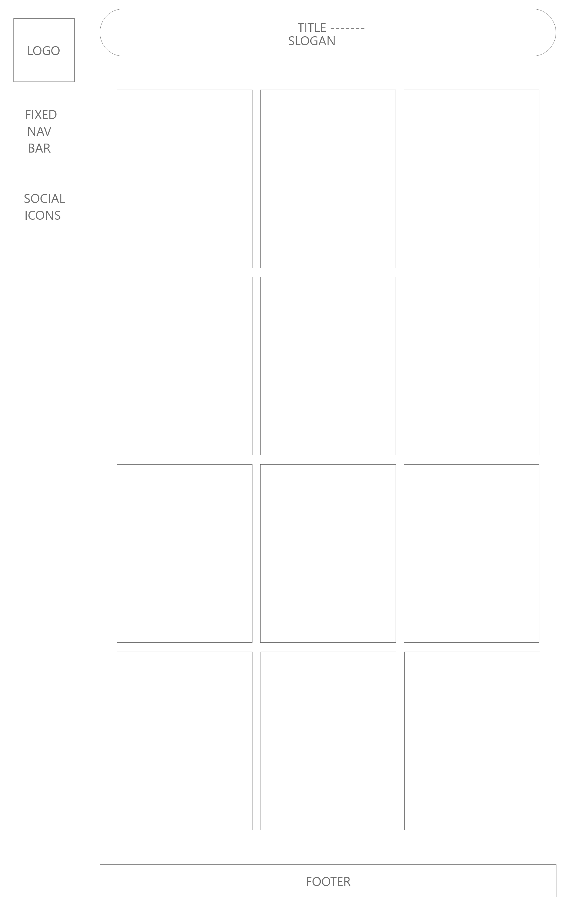
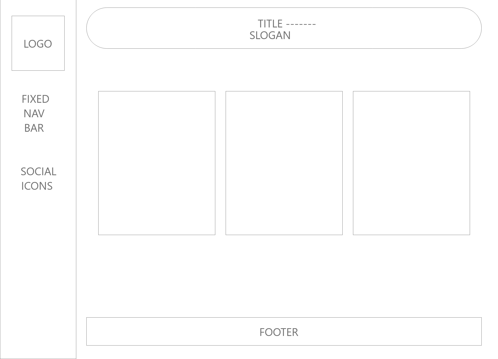

# Resc-u-r 1.0

201 final project/pet adoption matching site to find the best pet for you.

## Collaborators

- Matthew Barnhart
- Marie Antons
- Chase Nickels

Resc U r's is a pet adoption application designed to match the user with their ideal pet based on their own personality and preferences compared to the pet profiles available in our library.  For the sake of demonstration we are creating fake pet profiles that will be displayed accordingly.  The home page will be introductory as well as have a form that will return ideal matches based on the user input.  The second page will be a pet profiles page that displays all of the pets we have available in our library.  And finally we will have our about us page to show the users the masterminds behind this project.

Our problem domain is to offer the users a way to find their ideal pet based on their personality. Insetad of going to a shelter not knowing what you're looking for, our app gives you the chance to meet the pet you want. Also, by linking to different shelters with different hours we make those shelters and their pets and services mroe accessible by aggregating that information into one place.

## Wireframes

## Chart CDN

https://cdnjs.cloudflare.com/ajax/libs/Chart.js/2.9.3/Chart.bundle.min.js

## Code Reference Citations

- https://fonts.googleapis.com
- https://kit.fontawesome.com/988c5e7e3e.js
- https://www.w3schools.com/css/tryit.asp?filename=trycss_tooltip
- https://stackoverflow.com/questions/50788951/loop-through-image-array-with-pure-javascript
- https://medium.com/@zackcreach/shred-the-gnar-how-to-write-decode-regex-for-email-validation-9a970fa91641
- https://learn.shayhowe.com/advanced-html-css/transitions-animations/
- https://www.webdesignerdepot.com/2014/05/8-simple-css3-transitions-that-will-wow-your-users/